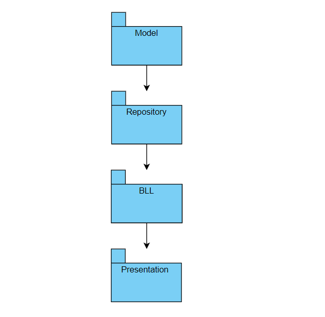
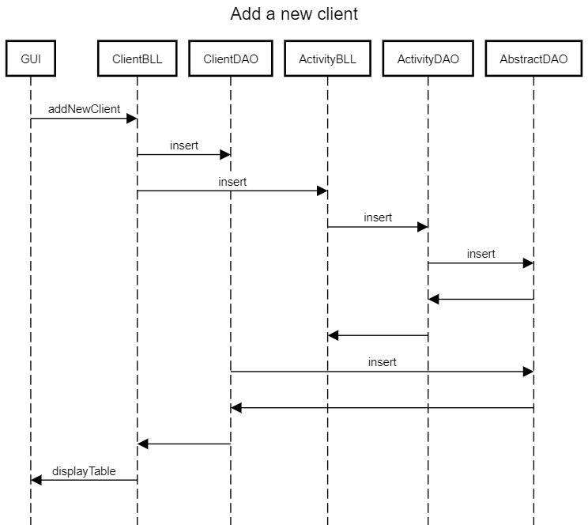
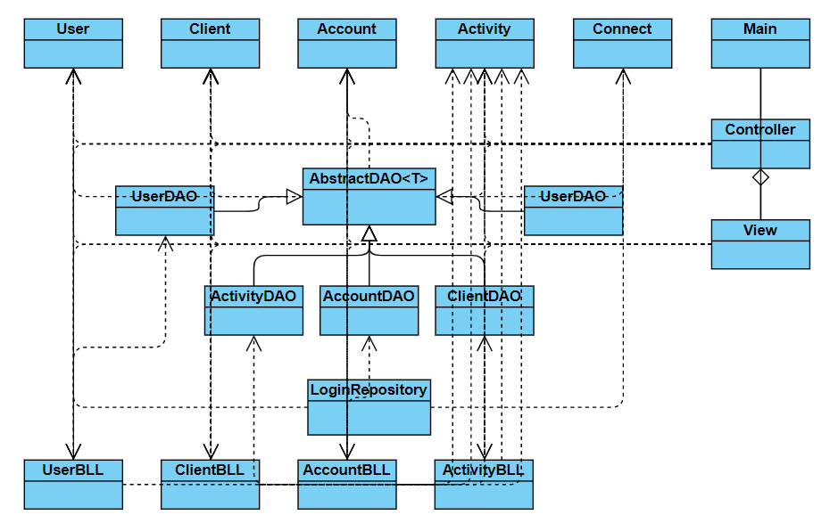

# Analysis and Design Document

# Requirement analysis

## Assignment Specification
Use JAVA/C# API to design and implement an application for the front desk employees of a bank. The application should have two types of users (a regular user represented by the front desk employee and an administrator user) which have to provide a username and a password in order to use the application.

## Function requirements
The regular user can perform the following operations:
- Add/update/view client information (name, identity card number, personal numerical code, address, etc.).
- Create/update/delete/view client account (account information: identification number, type, amount of money, date of creation).
- money between accounts.
- Process utilities bills.

The administrator user can perform the following operations:
- CRUD on employees’ information.
- Generate reports for a particular period containing the activities performed by an employee.

## Non-functional Requirements
- The data will be stored in a database. Use the Layers architectural pattern to organize your application. Use a domain logic pattern (transaction script or domain model) / a data source hybrid pattern (table module, active record) and a data source pure pattern (table data gateway, row data gateway, data mapper) most suitable for the application.
- do not use an Object Relational Mapper framework. Write the queries against the database in SQL.
- SQL script for creating and populating the database with initial values.
- the inputs of the application will be validated against invalid data before submitting the data and saving it in the database.

# Use-Case Model

## Use case 1

    * Use case: add employee
    * Level: one of: user-goal level
    * Primary actor: administrator
    * Main success scenario: login -> press add new employee button -> insert employee's information -> employee added to db
    * Extensions: login -> username does not exist
		  login -> incorrect password
		  login -> press add new employee button -> insert employee's information -> employee already exists

## Use case 2

    * Use case: delete account
    * Level: one of: user-goal level
    * Primary actor: employee
    * Main success scenario: login -> select account -> press delete button -> account deleted from db
    * Extensions: login -> username does not exist
		  login -> incorrect password
		  login -> account not selected

# System Architectural Design

## Architectural Pattern Description
The architercural pattern present in our application is Layers. This pattern is used to break apart a more complex software system and to minimize dependencies between layers. The higher layers use various services defined by the lower layers. The lower layers are unaware of the higher ones. The layers in my application are presentation, domain and data source. The presentation logic handles interaction between the user and the softare. Data source handles the communication with the database. The domain logic handles calculations and validations based on inputs and stored data.

## Diagrams

# UML Sequence Diagrams

# Class Design

## Design Patterns Description
Transaction Script Pattern was used to take the input from presentation, process it with validations and calculations and store the data in the DB, invoking operations.
The Data Access Object (DAO) Pattern was used in order to isolate the low level operations from high lever business services. We have the class AbstractDAO<T> which is extended by UserDAO, AccountDAO etc.
Reflection was used to give us information about the class to which an object belongs and also the methods of that class which can be executed using the object. Reflection was mainly used together with the DAO pattern to create queries and invoke methods specific to each class.

## UML Class Diagram

The layered pattern can be observed from the classes used. The DAO paterrn can also be observed by the classes which extend the AbstractDAO class.

# Data Model
The data model contains 4 classes (according to the 4 tables in the DB): User, Client, Account, Activity. Each class has constructors, getters and setters and a toString method. 
The User class contains the following fields: id(int), firstName(String), lastName(String), username(String), password(String), isAdmin(int).
The Client class contains the following fields: id(int), firstName(String), lastName(String), idCardNr(String), cnp(String), address(String).
The Account class contains the following fields: id(int), idClient(int), type(String), amount(int), dateOfCreation(String).
The Activity class contains the following fields: id(int), idEmployee(int), activity(String), involved(String), date(String).

# System Testing
The system was tested manually. I entered invalid data or left the fields blank to test the system's response. The system supports any kind of input from the user. The data is validated in the business layer, before commiting changes to the DB. 

# Bibliography
- [Online diagram drawing software](https://yuml.me/) ([Samples](https://yuml.me/diagram/scruffy/class/samples))
- [Yet another online diagram drawing software](https://www.draw.io)
